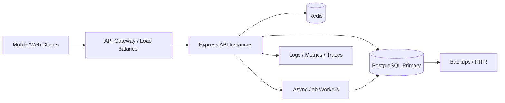
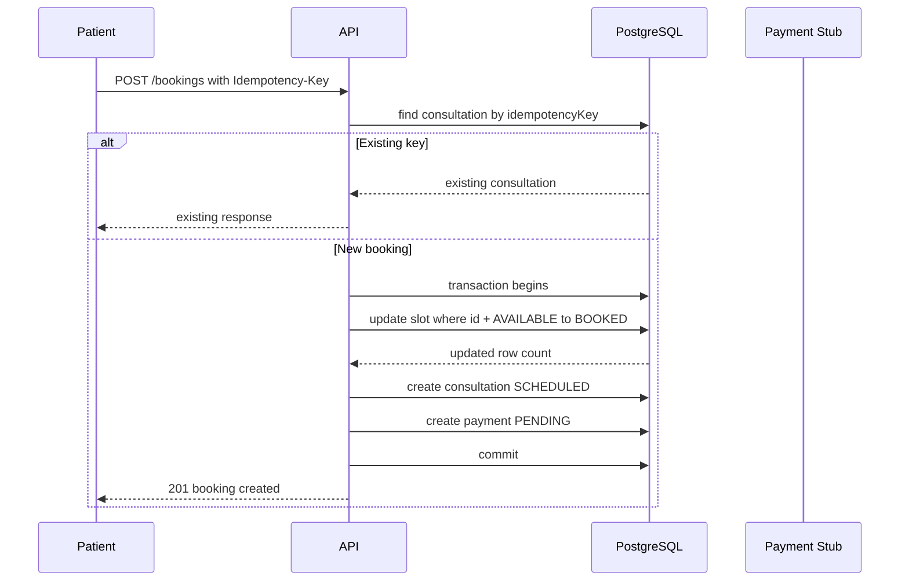
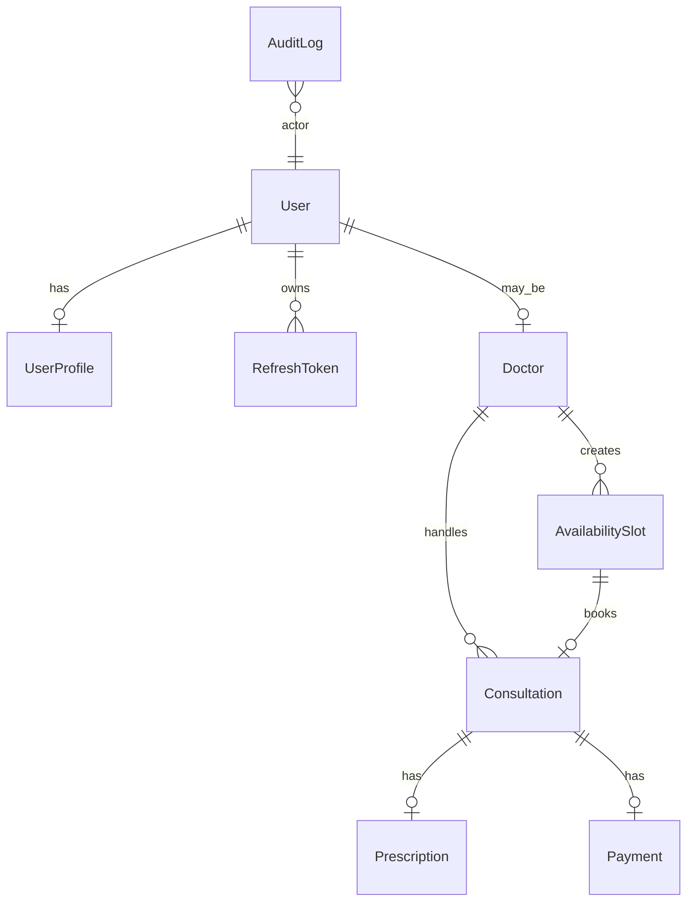

# Architecture

## Goals

The backend supports Amrutam's telemedicine workflows with secure user access, doctor availability, bookings, consultations, prescriptions, admin analytics, and auditability. The target scale is 100k consultations per day with p95 reads under 200 ms, p95 writes under 500 ms, and 99.95% availability.

## High-Level Design

The API is stateless and horizontally scalable. PostgreSQL is the source of truth for users, doctors, slots, consultations, prescriptions, payments, and audit logs. Redis is optional locally, but recommended in production for idempotency response caching, distributed rate limiting, and hot search/filter cache entries.

## Data Flow

1. Clients authenticate with email/password and receive short-lived access tokens plus refresh tokens.
2. Read endpoints query indexed PostgreSQL tables and return paginated responses.
3. Write endpoints validate input, authenticate users, apply RBAC, use idempotency keys, and execute transactionally.
4. Heavy side effects such as prescription PDF generation, notifications, and analytics rollups should be queued for workers.
5. Every request receives an `X-Request-ID` for traceability across logs and downstream calls.

## Booking Flow

The key concurrency control is the conditional update on `availability_slots`: only one transaction can change a slot from `AVAILABLE` to `BOOKED`. Later contenders receive `409 CONFLICT`.

## ER Diagram

## Retry And Backoff

Clients should retry safe reads with exponential backoff and jitter for transient `429`, `502`, `503`, and `504` responses. Write retries must include an `Idempotency-Key`. Server-side integrations such as payment capture, notification delivery, and PDF generation should use bounded retries: 100 ms, 500 ms, 2 s, 10 s, then dead-letter for manual replay.

## Data Partitioning

Start with indexed relational tables. At high volume, partition time-series tables by month:

- `audit_logs.created_at`
- `consultations.scheduled_at`
- `payments.created_at`

Keep recent partitions on fast storage and archive older partitions to lower-cost storage after retention windows expire.

## Caching

- Cache public doctor search filters for short TTLs, for example 30-120 seconds.
- Cache idempotent write responses for 24 hours keyed by user and `Idempotency-Key`.
- Use ETags or client-side cache for static schema/docs.
- Invalidate doctor and slot caches when availability changes.

## Transaction Management And Sagas

Booking uses a single database transaction for slot claim, consultation creation, and payment record creation. Cancellation is a compensation transaction that marks the consultation cancelled, restores the slot when eligible, and refunds completed payments in the local payment record. External payment gateways should be handled as a saga with webhook reconciliation and idempotent event handling.

## Backup And DR

- Enable automated PostgreSQL backups and point-in-time recovery.
- Retain daily backups for at least 30 days and monthly backups for compliance needs.
- Test restore quarterly into an isolated environment.
- Target RPO: 5 minutes with WAL archiving.
- Target RTO: 30 minutes with documented failover steps.
- Run API instances across at least two availability zones behind a load balancer.
